>[Apogee Digital Media Partners](https://www.apogeedigital.media) was conceived of by a passionate group of ad tech professionals determined to create a new programmatic advertising dogma. With over 20 years of combined experience spanning both sides of the ad tech ecosystem, we have recognized the need for an alternative to the bloated, black-box programmatic solutions available in the market today.

### Project Summary:

I worked with Apogee on a dataset for one client over one month. The general goal was to see if I could come up with any rules they could add to their business logic to improve the conversion rate of users. (a conversion being a sale or account creation, a user being a member of the public that saw the client's ad) I worked with the team at Apogee to narrow down the scope to a specific hypothesis listed below. For security purposes, no data or data cleaning code will be included online. Throughout the project, I tried to stick with techniques that are interpretable and scalable so I would be able to translate my results to new business rules and test against their full dataset, if applicable.

### Hypothesis:

Our hypothesis is that content browsed by individual users provides indication of intent for our client's
product/service. 

### Question:

Via user clustering, what types of content show the highest intent for our client's
product/service?

### How To Run:

Download the source code, find data that has a list of strings for the categories users visit and the number of times said user convered, run the main_code.py file.

### EDA:

The data I was given were all from one client for one month of activity. Each record represents an interaction between the user and the client's creative material: either the user saw, clicked on, or purchased through an ad. This means the data already has a selection bias: creative material is only shown in situations where Apogee has a reasonable belief that the user might wish to purchase something from the client. This means that any improvement above random guessing may be an improvement on Apogee's business logic, as long as it does not increase the false negative rate. 

4603 of 2069421 database records are conversion (that's 0.22% of the rows in the database). 

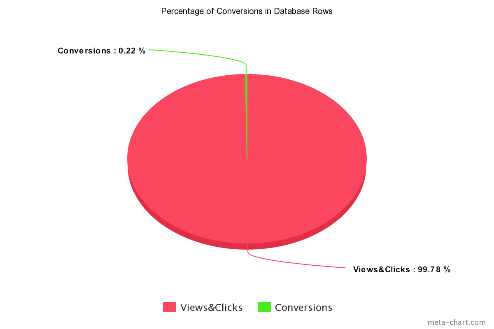

There are only 137951 unique users in the month. Of those, 2975 are conversions. (2.15% of records are linked to at least one conversion)

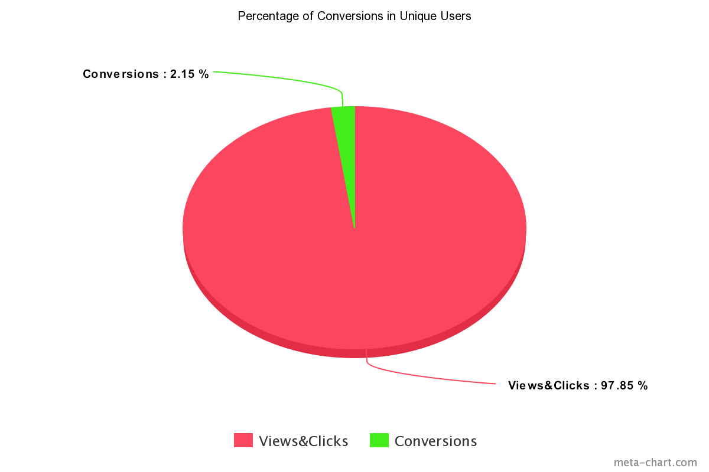

Due to this extream imbalance in the dataset and time constraints, I decided to focus on the user level data instead of attempting to improve predictions at the action level. I also looked at the distribution of total conversions across users, shown below. There is one user who 'converted' 40 times due to a sale on the client's side, which, coupled with the class imbalance, is likely to throw off an regression attempts.

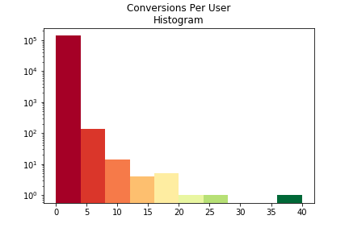

Due to the imbalances in the dataset, I also decided to use a two main undersampling techniques: 
- While working with the diminsionality reduction and intial grouping tests: I included all the positive class data and a randomly selected sample of equal size from the negative class. Each code snipet was run multiple times to see check for result variance due to changes in the available negative class data.
- While working on testing the affects of including clustering data in Regression and Classification: I withheld 20% of the positive class as part of the test data, oversampled the remaining positive class by 1.5 times its original size (with replacement), took a random sample from the negative class to bring it to 70% of the training dataset, and added the remaining negative class samples to the testing data. This means my test data was more imbalanced than the original dataset. I did this to stress test the models due to training them on UnderOverSampled data.

### Page Categories To Predictions:

The initial goal is to see if the websites visited by users is correlated with their likelyhood to purchase from the client. In order to look at this at a user level, rather than a per interaction level, the pages a user has visited have to be combined in some way. I chose to try using the page catagories (provided by the company running the bids for add locations) as a pre-cleaned bag of words for each user. 

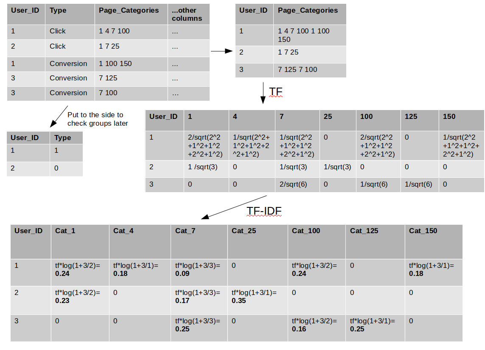

### Dimintionality Reduction:

Using sparse matrixes, like with TFIDF, leads to higher dimintionality than is usually not ideal for clustering and predictive models. Many clustering and predictive models don't accept sparse matrixes due to the computations required to make them work. I looked at dimintionality reduction options and chose TSVD because it allows for sparse matrixes and reduces in linear space, which is much easier to translate back into the original data than non-linear translations. I used a cumulative scree plot to determine about how many features I would need to use to explain at least 70% of the variance in the original data. Ideally, more variance would be included but performace further down the pipeline suffers as complexity goes up.

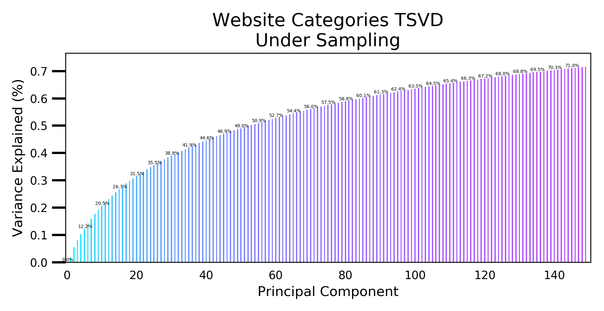

### Clustering:

[For a good analysis of different clustering options, check out this post.](http://hdbscan.readthedocs.io/en/latest/comparing_clustering_algorithms.html) After researching some of the options, I decided to focus on KMeans due to its scalability and the fact that it will accept a sparse matrix, if I later want to remove the dimintionality reduction from the pipeline. There are problems with KMeans when looking at a data set you aren't sure has clusters: 1) it's main parameter is the number of clusters, which is hard to know ahead of time 2) it will force all data points into clusters, even if some simply aren't part of a cluster. Some other algorithms I considered:
- DBSCAN was my initial choice because it scales to large data and doesn't force noise into clusters however it did not perform well on the current dataset. 
- Affinity Propagation is too slow to scale up to big data
- MeanShift in sklearn is also slow and assigned the whole dataset to one cluster
- Spectral Clustering has options for sparse data and reduces diminsionality, but isn't intended for this use. I looked at it in comparison to KMeans, but it wasn't able to out perform the simpler method.
- Agglomerative Clustering does not accept sparse data but it did run relatively quickly for me, opening the possibility of scaling it up to the full dataset. None of its variety of algorithms outperformed KMeans.

Because the data is in such high dimintional space, it is not possible to graph the clusters to check them. This left me with scoring options like the score in KMeans, Silhouette, and gap analyis (if a clustering set looks promising).

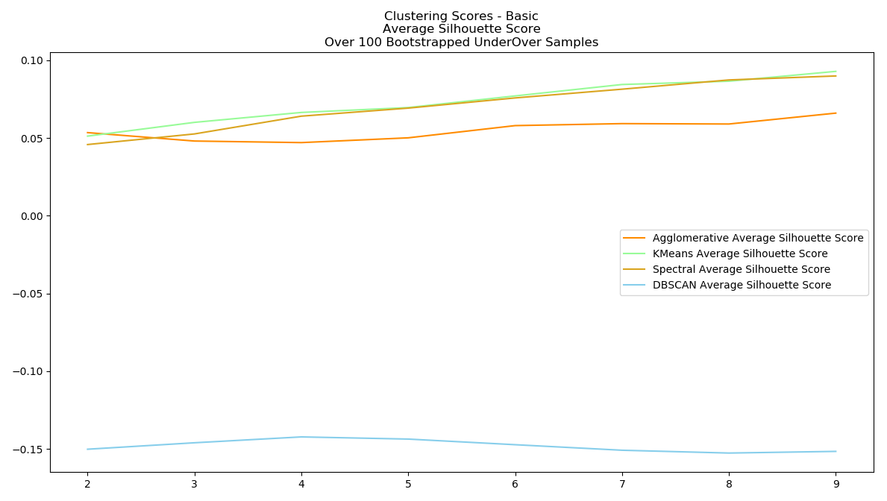

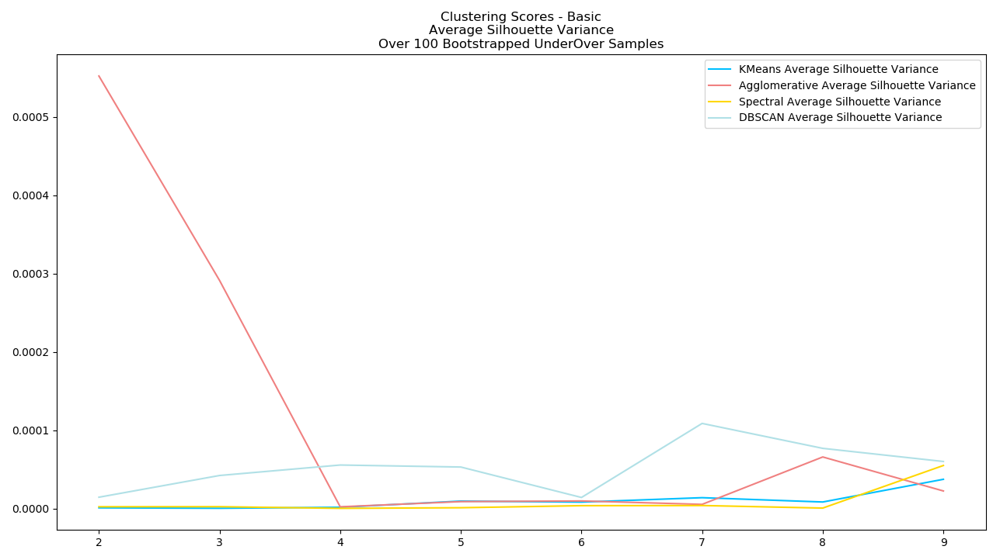

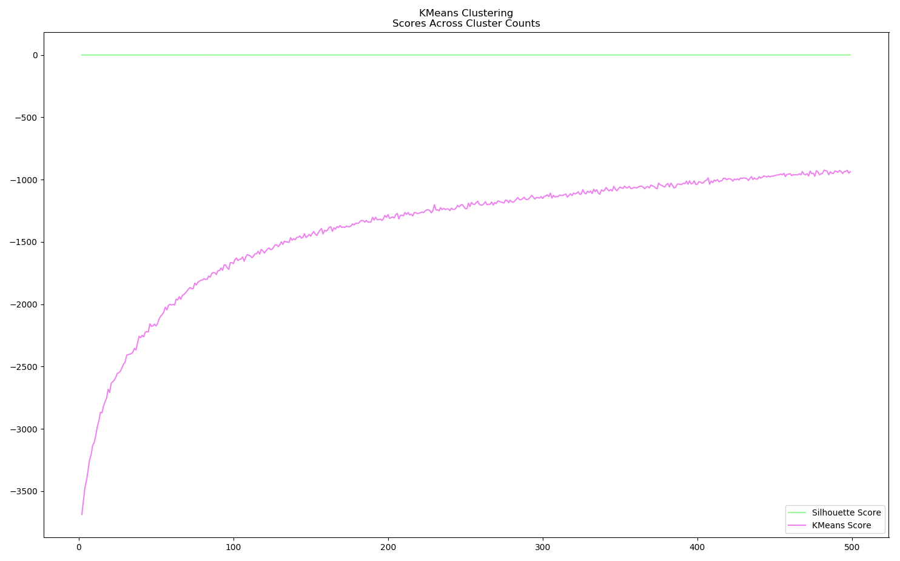

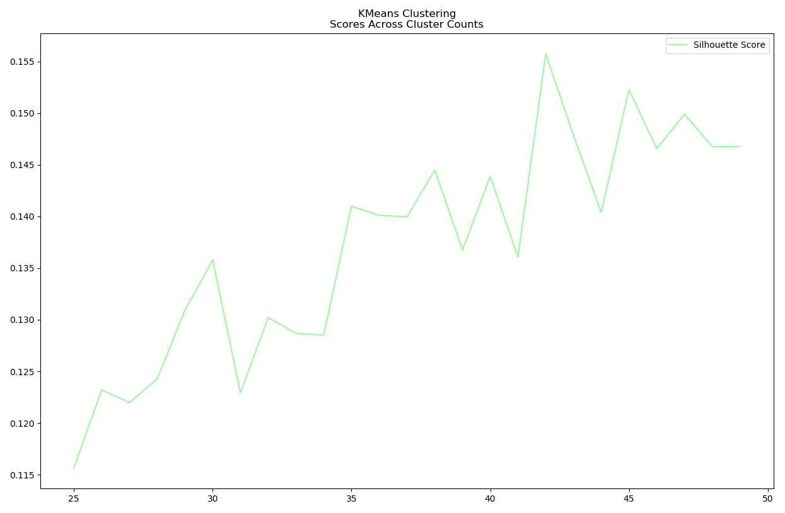

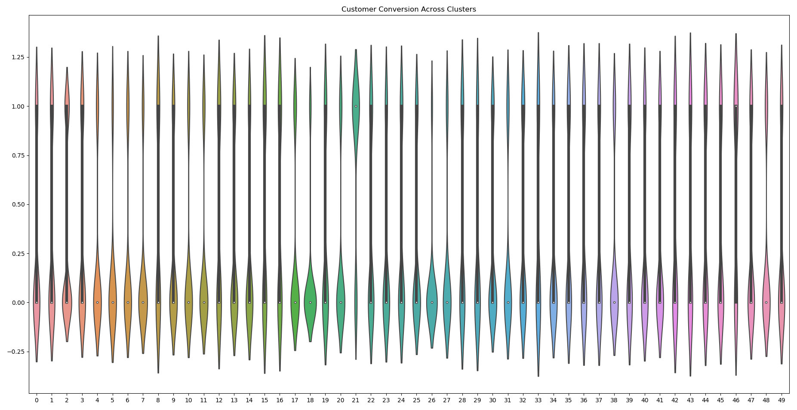

Based on the KMeans score and the low Silhouette score, it is fair to guess that MeanShift and DBSCAN failed to find clusters because there probably aren't any. In order to be sure, I continued on to testing if the clusters helped with the prediction of conversions.

### Testing Hypothesis:

I ran a RandomForestClassifier model with the vectorized categories per person as the dataset and convered/not convered as the target. I then added the KMeans cluster assignment to the dataset and refit the model. Below are the F1 and Recall scores across 5 fit/test iterations, UnderOverSampling each time so the model saw slightly different data. The results are consistent across the 5 runs, having good scores for training, slightly lower for the full data set and significanlty lower for the training set the model wasn't allowed to see at all.

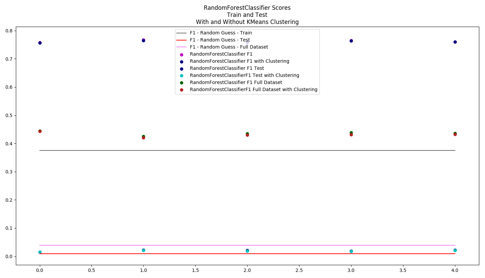

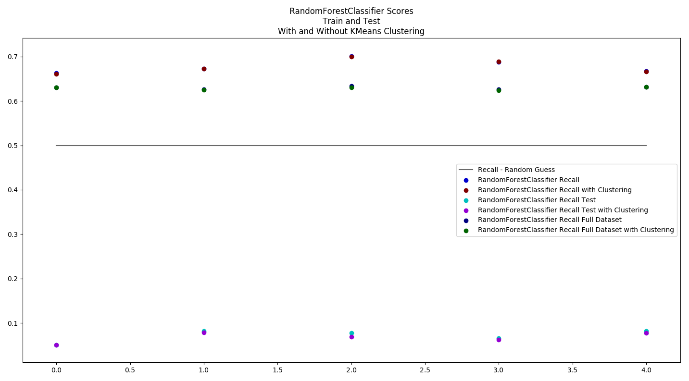

While the models are better than random guessing, the addition of the clusters does not help and the model's ability to predict purchases on entirly unseen data is not much better than a guess.

### Results:

At this time, I do not see any business value in adding clustering of a customer's website categories to Apogee's decision making process. 

### Next Steps:

- Add the timing information into the data. Right now, all categories are being treated the same regardless of when they were visted.
- Scraping additional data from websites visited by users who convered vs ones who didn't to see if there is additional useful information in the meta data not obviouse in the categories provided by the third party.
- Continued research into work by other groups similar to [this](https://link.springer.com/chapter/10.1007/978-3-319-19548-3_11).
