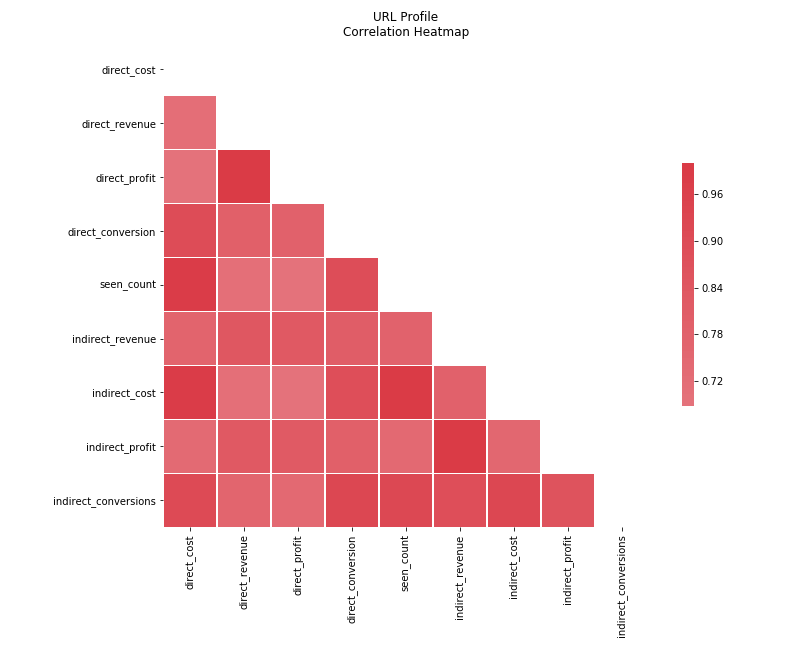
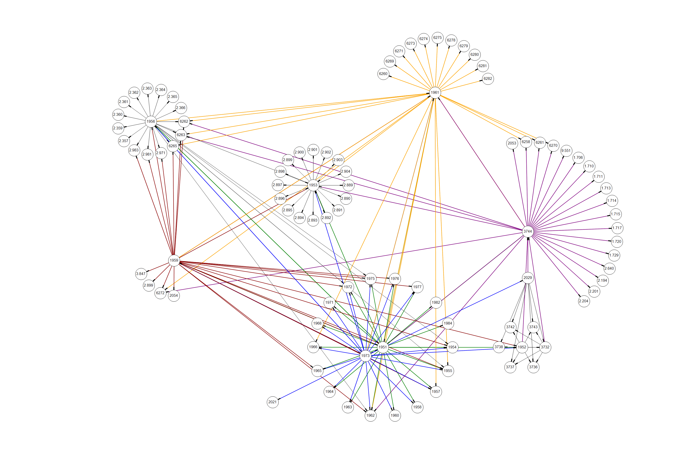

## Network Graphing of Links Between Webpages

#### Proprietary Information Concerns:

The analysis included in this project includes revenue and cost data. The examples given are examples and not the true values. They have been created to show the same relationships as the true data.

### Stack:


### Objectives:

+ Analyze existing data to determine if the associative rule of graph theory holds true for this application.

>>>Associative Rule: if person A knows person B and person C, person B and C are more likely to know each other than if they didn't know A. In this context, it means that if a user goes to multiple websites and we know that one of those websites is profitable, the other websites that person goes to are more likely to be profitable. Also, if a user goes to a website and that website has links, the person is more likely to be seen where the links lead than any randomly selected url. 

+ Create a web crawler that will perform a breadth first search for links on sites users have been seen at and map possible browsing routes from those starting points.
+ Create lists of likely profitable and unprofitable urls Apogee hasn’t advertised on before, at least in training set.
+ Compare predictions to full data set to see if how accurate they are.

### EDA and Feature Engineering:

The raw dataset I started with had interaction logs. This means each row in the dataset represented one add being shown to one user on one website. Each users could have multiple rows of data. Each website could be on multiple rows for one or more users. Cost and revenue are known per interaction, so I am able to determine the general profitability of each interaction, user, website..ect. For more indepth information about this, see the [EDA Project](https://github.com/AmeliaMaier/Capstone_Machine_Learning_Apogee/blob/refactor/edaREADME.md).

For this specific project, I feature engineered the direct and indirect profitability of each website users were seen at. I define direct profitability for a website to be the total revenue due to a conversion allocated to ad seen on that website minus the costs associated with that ad. An example of the aggregation is below:

| URL  |  Revenue  |  Cost  |  Conversion  |
| ---- | ---------:| ------ |:------:| 
| A    |  1        | .01    |  1     | 
| A    |  0        | .01    |  0     | 
| A    | .5        | .02    |  1     |  

| URL  |  Revenue  |  Cost  |  Direct Conversions  | Direct Profit  |  Times Seen | 
| ---- | ---------:| ------ |:------:|:------:|:------:| 
| A    |  1.5       | .03    |  2     | 1.47  |  3  |

I define indirect profitability for a website to be the total revenue for all users who have been seen at that site at least once minus the total cost for those same users minus the direct profit for the url in question. I remove the direct profits so that all that is remained is the profit from other urls seen by the same users that view the questioned url.

| User | URL | Revenue | Cost | Conversion |
| ---- | ---- | ------:| ------ |:------:| 
| 1   |  A    |  1     | .01   |  1       |
| 1   |  B    |  1.5     | .05   |  1       |
| 1   |  C    |  0     | .02   |  0       |
| 2   | A    |  0        | .01    |  0     | 
| 2   | A    | .5        | .02    |  1     |  
| 3   | B    | .5        | .02    |  1     |  

| User | Revenue | Cost | Conversion |
| ---- | ------:| ------ |:------:| 
| 1   |  2.5     | .08   |  2       |
| 2   | .5        | .03    |  1     |  

| URL  |  Direct Conversions  | Indirect Conversions | Direct Profit  | Indirect Profit |  Times Seen | 
| ---- |:------:|:------:|:------:|:------:|:------:| 
| A    |  2     |  1  | 1.47  |  1.42  |  3  |

Here is an example of the actual direct to indirecct proportions seen in the data:

| URL            |  URL ID  |  Direct Profit  |  Indirect Profit  |  Direct Conversion  |  Indirect Conversion  | Times Seen  |
| --------------------- |:--------:| ---------------:| ----------------- |:--------------:| ----------------:| -----------:|
| www.mail.yahoo.com/   |  1952    |  1              |  24.6             |    255         |  7996            |  125635     |
| www.ebay.co.uk/       |  3747    |  .10            |  .40              |  9             |  111             |  6419       |
| www.zillow.com/       | 496173   | -0.00225        |  -0.0225          |  0             |  21              |  1730       |

Based on the high positive correlation between the direct and indirect measures, users who are seen at one profitable website are likely to go to other profitable websites and users who go one unprofitable website are likely to go to other unprofitable websites.



### Webcraler:

I used beautiful soup to parse the html of the websites users were seen on in order to pull out the sites directly linked from there. Currently, the webcrawler is able to try up to 20 times on a website, with a wait between each attempt. If it does not recieve html from the site, it moves on to the next site on its list. If a website does not have any links, it moves on to the next site on the list. All urls at one depth will be checked before the webcralwer moves on to find links on the urls it found in the last round of scraping. Because requesting the html from a website is slow and an OS based operation, I set up multi-threading to allow up to 50 sites to be requested and pending response at a time. Future versions of the webcrawler would be more valuable if the ablity to find links in javascript/comments/ect was added.

I created a Postgres database to hold the url details (including url root and raw html incase changes to the evaluation in the future require parsing or subseting the data in a different way). Each thread was set to write its results to the database at the end of its parsing process. This is safe in python because the GlobalInterpreterLock insurse that only one thread is interacting with the database at a time.

Here is the structure of the database and tables I created:

```sql

CREATE DATABASE website_link_mapping;
CREATE TABLE urls (
url_ID SERIAL PRIMARY KEY,
url_raw VARCHAR UNIQUE NOT NULL,
root_url VARCHAR DEFAULT 'not_available',
site_description VARCHAR DEFAULT 'not_available',
date_scraped TIMESTAMP DEFAULT CURRENT_TIMESTAMP,
html_raw VARCHAR,
linked BOOLEAN DEFAULT False
);
CREATE TABLE website_links (
from_url_ID INTEGER NOT NULL REFERENCES urls(url_id),
to_url_ID INTEGER NOT NULL REFERENCES urls(url_id),
PRIMARY KEY (from_url_ID, to_url_ID)
);

```
The web-crawler was given 11,000 starting points and was stopped when the database contained about 4 million nodes with about
14 million edges. This allowed it to get a depth of 4 for most starting points. 


### Network Graphs:

Due to the size of the data involved, I was not able to graph the full dataset in a useful way. I used a recursive sql query to brake the data into sub-graphs, finding paths that spread out from the starting points. Below is the graph starting at 1952 (yahoo mail). It links to 18 other starting points which were all either profitable or seen very few times and just below profitable (suggesting they would be profitable if they were advertised on more often).




Below is the graph starting at 3747. It is an example of a profitable url that the webcrawler didn’t search far enough to link to
another known url.


In both cases shown, the webcrawler primary found links within one root group. For example: ebay mostly links ebay. In both these examples though, the webcrawler did link to at least one url outside the primary root, suggesting that it would branch to associated roots if given enough time. 

A list of sites to avoid and to focus on has been provided to Apogee and is being compared to the client’s full history.

### Conclusion:

Based on the data analysis, users who are seen at a website that has historically been profitable for Apogee and their client show are likely to be seen at other sites that are also profitable. 

Conversely, users that are seen at websites that have historically been unprofitable for Apogee and their client are unlikely to go to websites that are profitable.

The webcrawler correctly identified websites linked to the starting website that have also been profitable, along with a list
of websites that haven’t been seen in the past and are potentially new locations to advertise on.

Due to the interconnectedness of root websites (ebay leads to more ebay sites), it would be useful to allow the webcrawler to run for a longer time, creating deeper graphs with more chances to step outside the root website it started in.

Currently, I have not automated any logic for curating the list of urls suggested from the webcrawler process. This would likely be an indepth Analysis and NLP process: assessing if tech suport pages should or shouldn't be included, including knowledge gained from the EDA Project to determine if other country's versions of the website are worth including, comparing site descriptions to assist in valueing each url.
