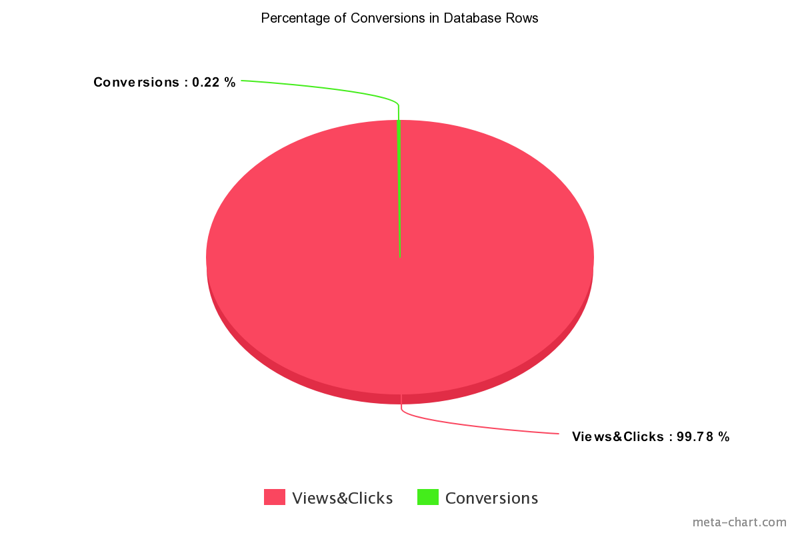

>[Apogee Digital Media Partners](https://www.apogeedigital.media) was conceived of by a passionate group of ad tech professionals determined to create a new programmatic advertising dogma. With over 20 years of combined experience spanning both sides of the ad tech ecosystem, we have recognized the need for an alternative to the bloated, black-box programmatic solutions available in the market today.

### Project Summary:

I worked with Apogee on a dataset for one client over one month. The general goal was to see if I could come up with any rules they could add to their business logic to improve the conversion rate of users. (a conversion being a sale or account creation, a user being a member of the public that saw the client's ad) I worked with the team at Apogee to narrow down the scope to a specific hypothesis listed below. For security purposes, no data or data cleaning code will be included online.

### Hypothesis:

Our hypothesis is that content browsed by individual users provides indication of intent for our client's
product/service. Via user clustering, what types of content show the highest intent for our client's
product/service?

### How To Run

### EDA

The data I was given were all from one client for one month of activity. Each record represents an interaction between the user and the client's creative material: either the user saw, clicked on, or purchased through an ad. This means the data already has a selection bias: creative material is only shown in situations where Apogee has a reasonable belief that the user might wish to purchase something from the client. This means that any improvement above random guessing may be an improvement on Apogee's business logic. 

4603 of 2069421 database records are conversion (that's 0.22% of the rows in the database). 

There are only 137951 unique users in the month. Of those, 2975 are conversions. (2.15% of records are linked to at least one conversion)

Due to this extream imbalance in the data and time constraints, I decided to focus on the user level data instead of attempting to improve predictions at the action level.

### Dimintionality Reduction

### Clustering

### Testing Hypothesis

### Results

### Next Steps
